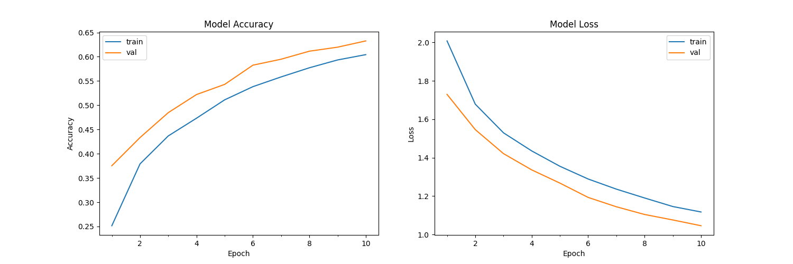

# LearnKeras

This repository contains some code for you to get started with keras with a few simple datasets.

## Compatibility

* This code runs on Python 3.5 and Keras 2.0.4 and has been tested on Ubuntu 16.04.

## Intro

* The folder `Intro` contains the keras implementation for the analysis of the pima-indians-diabetes dataset.

* It involves the prediction of a binary output variable using 8 input variables.

* The code `learnkeras1.py` steps you through the training process and also shows you how to save your model checkpoint.

* The code `learnkeras2.py` shows you how to load the above trained model and find accuracy.

## CIFAR-10

* The folder `CIFAR-10` contains the code for classifying images into 10 categories of the famous CIFAR-10 dataset.

* I have used a simple model architecture for easy understanding of code.

* The code can be run in train or test mode.

* To run in train mode, type `python cifar10.py --mode train`. This trains the model and saves the checkpoint in the folder. It will also make predictions on test data and print the accuracy.

* To run in test mode, type `python cifar10.py --mode test`. This will output the test accuracy using weights from the checkpoint saved.

* Download the checkpoint for 10 epochs [here.](https://drive.google.com/open?id=1NsZDL8dKEwSFRdQ1nfAisRbXqe-46Lmo)

